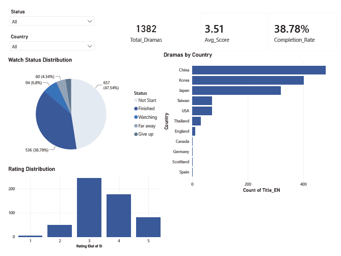
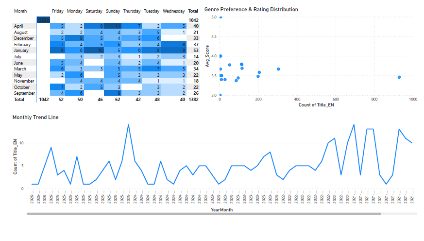
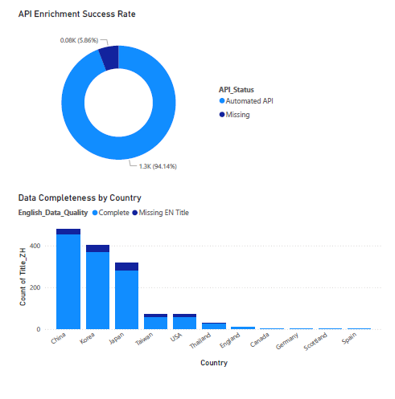

# drama-tracker
An end-to-end data analytics project that bridges the gap between raw, unstructured media logs and corporate-ready business intelligence. The workflow transforms over 1,300 rows of messy personal viewing history from a Notion export into a fully automated data pipeline. By leveraging Python for API metadata enrichment, resolving multi-valued tag conflicts through advanced Star Schema data modeling, and engineering comprehensive DAX calculations, this solution delivers deep insights into viewing behaviors, temporal patterns, and data quality governance across a highly polished 3-page interactive dashboard.

---

## 📈 At a Glance
- **Total_Dramas:** 1382
- **Avg_Score:** 3.51
- **Completion_Rate:** 38.78%
- **Data_Enrichment_Rate:** 94.14%

---

## 🛠️ Tech Stack & Methodologies
- **Languages & Libraries:** Python, Pandas, Requests, JSON
- **BI & Analytics:** Power BI Desktop, DAX, Power Query
- **Database Architecture:** Star Schema Model, Granularity Isolation
- **Data Pipeline:** REST API Integration (The Movie Database - TMDB)

---

## 🚀 Key Deliverables & Achievements

* **Automated Python ETL Pipeline:** Built a robust Python script integrating TMDB API to resolve localized, unstructured Chinese titles via fuzzy text matching, programmatically fetching official metadata IDs, English titles, and standardized genres.
* **Granularity Isolation via Star Schema:** Successfully addressed the multi-valued attribute problem (shows with multiple genres) in Power BI by engineering a 1-to-Many bridge table (`Fact_Genre_Analysis`). This isolated atomic data granularity and prevented high-level KPI inflation/duplication.
* **Advanced Temporal Modeling:** Developed an independent date dimension table (`Dim_Calendar`) using complex DAX expressions, unlocking dynamic time-series trends and seasonal behavior tracking.
* **Data Quality & Lineage Governance:** Designed a dedicated Data Governance dashboard that screens for empty strings (`""`) vs. true `BLANK` anomalies and tracks programmatic enrichment success rates row-by-row for auditing.

---

## 📊 Dashboard Architecture (3-Page Tiered System)

### Page 1: Executive Summary
A high-level grid system capturing macro business postures, performance statistics (Completion Rates, Average Score Distribution), and country-level ranking insights.



### Page 2: Temporal & Behavioral Insights
Features an interactive Binge-Watching Heatmap crossing `Month` vs. `Weekday` density scales to isolate seasonal consumption fluctuations and user fatigue patterns.



### Page 3: Data Lineage & Quality Audit Trail
An advanced technical audit dashboard revealing data completeness metrics across countries, API automatic coverage ratios, and an embedded transactional audit trail table.



---

## 📂 Project Structure
```text
├── README.md               # Main project documentation
├── data/                   # Source and processed datasets
├── scripts/                # Python API ETL script
└── powerbi/                # Power BI Desktop (.pbix) file
